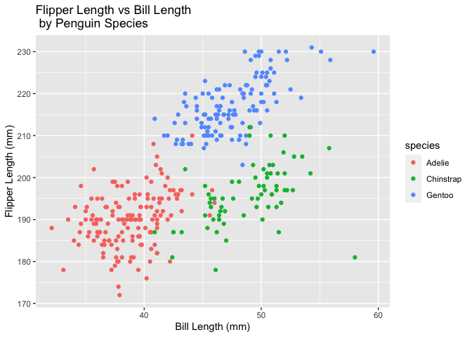

HW1\_asa2249\_BIST8105
================
Armaan Ahmed
9/28/2021

load necessary packages for the script

``` r
  library(tidyverse)
```

    ## ── Attaching packages ─────────────────────────────────────── tidyverse 1.3.1 ──

    ## ✓ ggplot2 3.3.5     ✓ purrr   0.3.4
    ## ✓ tibble  3.1.2     ✓ dplyr   1.0.7
    ## ✓ tidyr   1.1.3     ✓ stringr 1.4.0
    ## ✓ readr   2.0.1     ✓ forcats 0.5.1

    ## ── Conflicts ────────────────────────────────────────── tidyverse_conflicts() ──
    ## x dplyr::filter() masks stats::filter()
    ## x dplyr::lag()    masks stats::lag()

``` r
  library(ggplot2)
  library(palmerpenguins)
```

Problem 1

``` r
# I decided to set echo to true, so you can see both my code and the results in the knitted HTML file.

# problem1_DF is a data frame that consists of various data types, including a standard normal distribution of numbers, boolean values, character and factor vectors.

problem1_DF = 
  tibble(
    normal_distribution_values = rnorm(10),
    logical_vector = normal_distribution_values>0,
    charactor_vector_10 = c("go", "on", "I", "know", "it", "not", "me", "not", "hermoine", "YOU"),
    factor_vector_10 = factor(c("harry", "hermoine", "ron", "ron", "ron", "hermoine", "harry", "hermoine", "harry", "ron"))
  )

# generates a table of problem1_DF to inspect whether values have successfully been input
view(problem1_DF, n = 10)

# Take the mean of each set of values in the dataframe

# Take the mean of the normally distributed 10 values that were generated
ndist_mean = mean(problem1_DF %>% pull(1))
ndist_mean
```

    ## [1] 0.2634887

``` r
#ndist_mean = ~-0.228, which is about what we would expect

# Take the mean of the logical vector
logvec_mean = mean(problem1_DF %>% pull(2))
logvec_mean
```

    ## [1] 0.6

``` r
# logvec_mean = 0.3, which assumes TRUE = 1, and FALSE = 0.

# Take the mean of the character vector
chvec_mean = mean(problem1_DF %>% pull(3))
```

    ## Warning in mean.default(problem1_DF %>% pull(3)): argument is not numeric or
    ## logical: returning NA

``` r
chvec_mean
```

    ## [1] NA

``` r
# Take the mean of the factor vector
factor_mean = mean(problem1_DF %>% pull(4))
```

    ## Warning in mean.default(problem1_DF %>% pull(4)): argument is not numeric or
    ## logical: returning NA

``` r
factor_mean
```

    ## [1] NA

this code chunk converts logical, character and factor variables into a
numeric type, derived from the problem1\_DF dataframe and using the
as.numeric function.

``` r
#eval is set to false to show the chunk, not the output
# Convert the logical vector into a numeric type
logical_vector = problem1_DF %>% pull(2)
logical_vector_numeric = as.numeric(logical_vector)
logvec_mean_num = mean(logical_vector_numeric)
logvec_mean_num
# logvec_mean_num = 0.4 (this varies depending on the run), which assumes TRUE = 1, and FALSE = 0. This is the same as before, because R interprets booleans as TRUE = 1 and FALSE = 0.

# Convert the character vector into a numeric type
charactor_vector = problem1_DF %>% pull(3)
charactor_vector_numeric = as.numeric(charactor_vector)
character_vector_mean_num = mean(charactor_vector_numeric)
character_vector_mean_num
# character_vector_mean_num =


# Convert the factor vector into a numeric type
factor_vector = problem1_DF %>% pull(4)
factor_vector_numeric = as.numeric(factor_vector)
factor_vector_mean_num = mean(factor_vector_numeric)
factor_vector_mean_num
# factor_vector_mean_num = 2.1, because as.numeric converts the charactor factor vector values into 1, 2, 3 (or levels), which we can now take the mean of. 
```

Problem 2

``` r
#load the penguins dataset
data("penguins", package = "palmerpenguins")

#determine some summary statistics about the penguins dataset
summary(penguins)
```

    ##       species          island    bill_length_mm  bill_depth_mm  
    ##  Adelie   :152   Biscoe   :168   Min.   :32.10   Min.   :13.10  
    ##  Chinstrap: 68   Dream    :124   1st Qu.:39.23   1st Qu.:15.60  
    ##  Gentoo   :124   Torgersen: 52   Median :44.45   Median :17.30  
    ##                                  Mean   :43.92   Mean   :17.15  
    ##                                  3rd Qu.:48.50   3rd Qu.:18.70  
    ##                                  Max.   :59.60   Max.   :21.50  
    ##                                  NA's   :2       NA's   :2      
    ##  flipper_length_mm  body_mass_g       sex           year     
    ##  Min.   :172.0     Min.   :2700   female:165   Min.   :2007  
    ##  1st Qu.:190.0     1st Qu.:3550   male  :168   1st Qu.:2007  
    ##  Median :197.0     Median :4050   NA's  : 11   Median :2008  
    ##  Mean   :200.9     Mean   :4202                Mean   :2008  
    ##  3rd Qu.:213.0     3rd Qu.:4750                3rd Qu.:2009  
    ##  Max.   :231.0     Max.   :6300                Max.   :2009  
    ##  NA's   :2         NA's   :2

``` r
#running the summary function, we see that there are three species (Adelie, Chinstrap, and Gentoo) and three islands (Biscoe, Dream, Torgersen). There are 152 Adelie penguins, 68 Chinstrap penguins. Other variables of interest include the average bill length and bill depth, flipper length, body mass, penguin sex and year of observation.
head(penguins)
```

    ## # A tibble: 6 x 8
    ##   species island bill_length_mm bill_depth_mm flipper_length_… body_mass_g sex  
    ##   <fct>   <fct>           <dbl>         <dbl>            <int>       <int> <fct>
    ## 1 Adelie  Torge…           39.1          18.7              181        3750 male 
    ## 2 Adelie  Torge…           39.5          17.4              186        3800 fema…
    ## 3 Adelie  Torge…           40.3          18                195        3250 fema…
    ## 4 Adelie  Torge…           NA            NA                 NA          NA <NA> 
    ## 5 Adelie  Torge…           36.7          19.3              193        3450 fema…
    ## 6 Adelie  Torge…           39.3          20.6              190        3650 male 
    ## # … with 1 more variable: year <int>

``` r
#the number of rows and columns in the penguins dataset
num_columns = ncol(penguins)
num_columns
```

    ## [1] 8

``` r
num_rows = nrow(penguins)
num_rows
```

    ## [1] 344

``` r
#there are 344 rows and 8 columns in the penguins dataset.

#the mean flipper length
flipper_length_mm = penguins %>% pull(3) %>% na.omit()
flipper_length_mm_mean = mean(flipper_length_mm)
flipper_length_mm_mean
```

    ## [1] 43.92193

``` r
#the mean flipper length of the penguins in this dataset is 43.92193mm
```

``` r
#generate a scatterplot of bill_length_mm (x) vs flipper_length_mm (y), with points colored by species
flipper_plot = ggplot(data = penguins, aes(x = bill_length_mm, y =flipper_length_mm, color = species)) + geom_point() + ggtitle("Flipper Length vs Bill Length \n by Penguin Species") + xlab("Bill Length (mm)") + ylab("Flipper Length (mm)")
plot(flipper_plot)
```

    ## Warning: Removed 2 rows containing missing values (geom_point).

<!-- -->

``` r
#save the scatterplot
ggsave("scatter_plot.pdf", height = 4, width = 6)
```

    ## Warning: Removed 2 rows containing missing values (geom_point).
